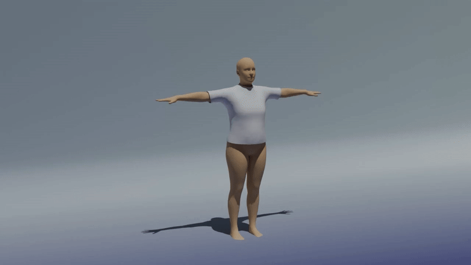
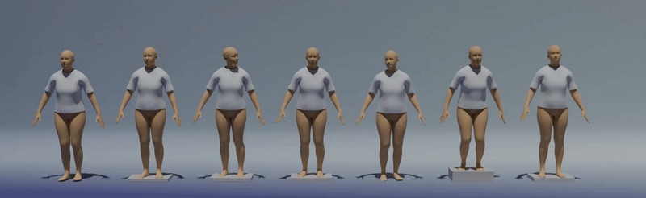

# Self-supervised-Garment-Dynamics-with-Persistent-Wrinkles
This is our ECCV 2026 paper, Self-supervised Garment Dynamics with Persistent Wrinkles.

## EPNet

EPNet predicts elastic garment motion and persistent wrinkle rest states from SMPL motion sequences. The released project contains the trained E-Net/P-Net weights and seven curated demo motions ordered by increasing waist bending and wrinkle strength.



**Figure 1.** Abdominal wrinkles before and after waist bending.



**Figure 2.** Motions of the same type with increasing waist-bending amplitudes. Larger abdominal garment deformation produces deeper persistent wrinkles.

## Project Layout

```text
body_models/        SMPL body and tshirt mesh assets
configs/            EPNet experiment configuration
data/smpl/          curated motion sequences
data/txt/smpl/      ordered sequence list
epnet/              graph P-Net feature/model utilities
loss/               elastic, bending, collision, and rest-conditioning losses
model/              E-Net body, cloth, LBS, and neural cloth simulation modules
utils/              mesh, rotation, IO, configuration, and collision helpers
results/            released checkpoints only
scripts/            runnable training/prediction commands
epnet_cli.py        main command-line entry
```

## Environment

Use the TensorFlow environment used by the elastic model. The core dependencies are:

```text
python 3.10
tensorflow 2.x with GPU support
numpy
scipy
tqdm
trimesh
h5py
```

Check the environment:

```bash
python epnet_cli.py check-env
```

## Curated Demo Motions

The included seven motions are ordered from weaker to stronger waist bending:

```text
1. CMUCanonArmOpen_105_105_43
2. CMUCanonArmOpen_105_105_38
3. CMUCanonArmOpen_105_105_44
4. CMUCanonArmOpen_105_105_37
5. CMUCanonArmOpen_02_02_04
6. CMUCanonArmOpen_105_105_39
7. CMUCanonArmOpen_105_105_45
```

The data list is:

```text
data/txt/smpl/smpl_demo.txt
```

## Released Checkpoints

E-Net checkpoint:

```text
results/demo_enet/checkpoints/enet/epnet_demo_3
```

P-Net checkpoint:

```text
results/demo_pnet/checkpoints/pnet/pnet.weights.h5
```

## Predict PC2

Generate P-Net rest states and final PC2 files for the seven curated motions:

```bash
python epnet_cli.py predict-proxy \
  --config configs/epnet_demo.json \
  --gpu-id 0 \
  --checkpoint-results-dir results/demo_enet \
  --pnet-ckpt results/demo_pnet/checkpoints/pnet/pnet.weights.h5 \
  --out-dir results/demo_prediction \
  --proxy-iteration 3 \
  --elasticity-iteration 3 \
  --alpha-cutoff 0.005 \
  --drive-threshold 0.05 \
  --drive-window 5 \
  --drive-min-frames 3 \
  --rest-scale 1.0 \
  --warmup-frames 20 \
  --collision-projection-threshold 0.004 \
  --stage-feature-mode scalar \
  --stage-normalizer 3 \
  --topology-cache results/cache/topology_epnet_tshirt.npz \
  --feature-cache-dir results/feature_cache/demo
```

Output PC2 files are written to:

```text
results/demo_prediction/render/<motion_name>/tshirt.pc2
```

If `rest` already exists and only the final PC2 needs to be regenerated:

```bash
python epnet_cli.py predict \
  --config configs/epnet_demo.json \
  --gpu-id 0 \
  --plasticity-dir results/demo_prediction/rest \
  --out-dir results/demo_prediction \
  --results-dir results/demo_enet \
  --elasticity-iteration 3 \
  --warmup-frames 20 \
  --collision-projection-threshold 0.004
```

## Training

Train E-Net from scratch:

```bash
python epnet_cli.py train-elastic \
  --config configs/epnet_demo.json \
  --gpu-id 0 \
  --results-dir results/demo_enet_train \
  --start-iteration 0 \
  --end-iteration 4
```

Train frame-wise P-Net from the trained E-Net outputs:

```bash
python epnet_cli.py train-proxy-pnet \
  --config configs/epnet_demo.json \
  --gpu-id 0 \
  --checkpoint-results-dir results/demo_enet_train \
  --out-dir results/demo_pnet_train \
  --proxy-iteration 3 \
  --epochs 80 \
  --lr 2e-5 \
  --output-mode delta_direct \
  --stage-feature-mode scalar \
  --stage-normalizer 3 \
  --active-weight 1.0 \
  --active-threshold 1e-4 \
  --drive-threshold 0.05 \
  --inactive-weight 0.03 \
  --time-batch-size 1 \
  --topology-cache results/cache/topology_epnet_tshirt.npz \
  --feature-cache-dir results/feature_cache/demo
```

Prediction uses temporal update gating:

```text
drive-threshold = 0.05
drive-window = 5
drive-min-frames = 3
alpha-cutoff = 0.005
rest-scale = 1.0
```

